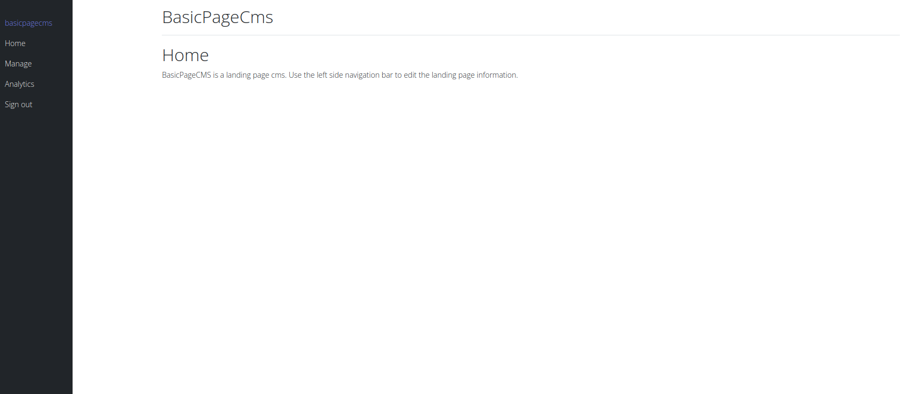

# BasicPageCMS

BasicpageCMS is an application that provides a very basic landing page for quick setup consisting of a title and message (which can be an update or a status message).

The content can be managed from a dashboard. 

Data on page requests is also provided so users can see how often the page is being viewed.